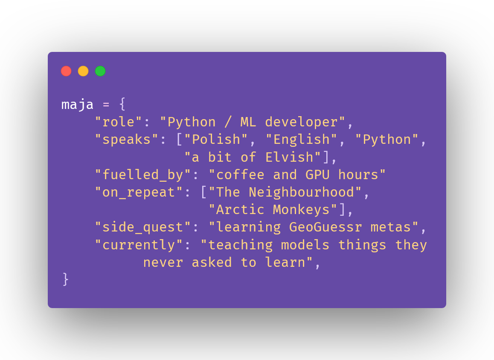

  

   

  <i>Junior Python / Machine Learning developer 
  from Poland. 
  I build end-to-end projects, 
  from training the model 
  to shipping it with an API and a frontend.</i>

🔍 <b>Open to work.</b> 
I'm looking for a junior role in ML, AI or Python development.

 

<h2 align="center">Tech stack</h2>

  
| ML / AI | Backend | Frontend | Deployment | Learning |
|:---:|:---:|:---:|:---:|:---:|
|         |    |      |    |   |

<h2 align="center">Featured Projects</h2>

<h3 align="center">🍽️ <a href="https://github.com/majkab8/Conaobiad">Obiadowo</a> · <a href="https://obiadowo.vercel.app">live demo</a></h3>

  AI recipe assistant for Polish cuisine. Built as a <b>RAG</b> pipeline over ~200 recipes stored in Pinecone. 
  The steps are written by <b>my own fine-tuned Polish LLM</b>. I distilled Bielik-11B into Bielik-1.5B with <b>LoRA</b> 
  and published the model on the <a href="https://huggingface.co/Mijuub/conaobiad-polka">Hugging Face Hub</a>. 

  <code>FastAPI</code> · <code>React</code> · <code>Pinecone</code> · <code>transformers</code> · <code>peft</code> · <code>HF Spaces</code> · <code>Vercel</code>

<h3 align="center">👗 <a href="https://github.com/majkab8/DressUP---classification-model">DressUP: fashion classification model</a></h3>

  Multi-head <b>EfficientNet-B0</b> classifier that tags clothing photos with type, colour, usage and season. 
  It reaches 93% accuracy on usage and 89% on type. Served as a <b>FastAPI</b> endpoint in Docker on <b>Azure Container Apps</b>. 

  <code>PyTorch Lightning</code> · <code>FastAPI</code> · <code>Docker</code> · <code>Azure</code>

<h3 align="center">🧝 <a href="https://github.com/majkab8/ELF-language-translator">English → Elvish translator</a> · <a href="https://huggingface.co/Mijuub/eldamo-en-elvish">model on Hugging Face</a></h3>

  Fine-tuned Helsinki-NLP MarianMT model that translates English into Tolkien's Quenya. 
  It was trained on 10k word pairs from the Eldamo lexicon. You can use it from the CLI or from a Flask web page. 

  <code>transformers</code> · <code>PyTorch</code> · <code>Flask</code>

<h3 align="center">🎧 <a href="https://github.com/majkab8/DJ-site">DJ Adriano: website for a client</a> · <a href="https://adrianodj.pl">live</a></h3>

  Responsive one-page promo site for a wedding DJ. Hand-written HTML/CSS with no frameworks. 
  It's deployed on Vercel with a custom domain. 

  <code>HTML</code> · <code>CSS</code> · <code>Vercel</code>

<h2 align="center">Contact</h2>

  
  
  
  

